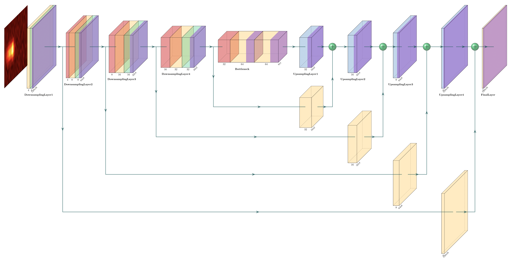

# Analyzing and Comparing Performance of Spatial Attention to UNet Structure for Single-Molecule Microscopy Spectral Image Denoising

This project implements a deep learning model implementing a spatial attention layer to each of the upsampling layers
within the traditional UNet architecture for processing spectral images. The goal is to predict the background
(and thereby) the spectra information using simulated Perlin and Gaussian noise spectral images. We demonstrate that
this implementation can produce significant improvements both quantitatively (~30-40% RMSE reduction) and qualitatively.
Moreover, our project implementation is highly configurable, as it supports training/testing with the same or different
datasets, changing hyperparameters, and more.

## Table of Contents
1. [Project Structure](#project-structure)
2. [Models](#models)
3. [Setup](#setup)
4. [Usage](#usage)
5. [Contributions](#contributions)
6. [Acknowledgments](#acknowledgments)

## Project Structure
```
├── .idea/
├── __pycache__/
├── data/                    # Folder to store all datasets (not in this repository)
├── test_models/             # Folder for saving trained models and test results (not in this repository)
├── README.md                # Project documentation (This file)
├── main.py                  # Main script to run training or testing
├── config.py                # Configuration settings, hyperparameters, and paths
├── dataset.py               # Data loading and preprocessing functions
├── train.py                 # Training script
├── test_background.py       # Testing script for background predictions
├── test_spectra.py          # Testing script for spectral predictions
├── utils.py                 # Utility functions (e.g., setting random seed, logging)
├── models.py                # Model definitions (Conventional UNet, Spatial Attention UNet)
├── hyperparameter_search.py # Test various hyperparameter combinations to determine best-performing variation
├── requirements.txt         # List of dependencies
└── .gitignore               # Git ignore file to exclude unnecessary files
```

## Models

Currently, the following models have been added for training/testing to this repository:

### Conventional UNet

The conventional UNet structure takes a given image with dimensions of `16x128` and applies the following transformations:
- 4 Downsampling Blocks
- Bottleneck
- 4 Upsampling Blocks
- Final Convolutional Layer and Relu

The overall structure can be visualized in the image below:


### Spatial Attention UNet

From this conventional UNet, we added a spatial attention mechanism to each of the upsampling layers, proposed from the `Attention U-Net:
Learning Where to Look for the Pancreas` paper. 

The overall structure can be visualized in the image below:

## Setup

1. First, please `git clone` the repository to your local machine,
making sure you are in the current working directory of the folder you cloned to.
2. Next, run `pip -r requirements.txt` to download the required Python packages and repositories.

At the moment, the current Python libraries are being used:
- `h5py`: For importing MATLAB data files `.mat` to Python
- `torch`: For training Python models with the dataset
- `matplotlib`: For general data visualization
- `numpy`: For data manipulation

## Usage

### Loading a Dataset

If you would like to load an existing dataset, ensure that the dataset structure matches the one you are trying to load,
as can be seen in the code snippet from `dataset.py` below:

```
TRAINING_DATA_PATH = (f"../data/Training_{args.noise_type}{args.train_dataset_size // 1000}k_"
                          f"P{args.noise_type.lower()}{args.noise_level // 1000}k{NOISE_SCALE_STR}"
                          f"{config.NORMALIZATION_TECH}.mat")
TESTING_DATA_PATH = (f"../data/Testing_{args.noise_type}{args.test_dataset_size // 1000}k_"
                         f"P{args.noise_type.lower()}{args.noise_level // 1000}k{NOISE_SCALE_STR}"
                         f"{config.NORMALIZATION_TECH}.mat")
```

The filename can be defined with the following features:

1. Training or Testing dataset
2. Noise type (Gaussian, Perlin, etc.) - `args.noise_type`
3. Dataset size - `args.train_dataset_size` or `args.test_dataset_size`
4. Noise level - `args.noise_level`
5. Noise scale (if applicable) - `args.noise_type`
6. Normalization Technique - `config.NORMALIZATION_TECH`

### Loading a New Dataset
In order to load a new dataset, make sure that the new dataset is of type `.mat`,
can be loaded with the `h5py` Python library, and is formatted similar to the structure 
shown above.

Note: Currently, all images that are supported are of shape `128x16`.

### Training a Model

1. Run the following script, adjusting `config.py`'s `model_type` variable to one of the following supported models:
- 'unet' - Conventional UNet
- 'attention_unet' - Spatial Attention UNet
- 'all' - All UNet structures

2. Next, run the `main.py` script with the `--train` flag, which wil call the `train.py` file to train the model.
3. Make sure to define the hyperparameters by calling the specific flags defined in the `args` variable in `main.py`.
4. Currently, the normalization technique is defined `config.py`, so make sure that is correct as well.
5. At the end of training, for each model set to train, it will store the following into its respective folder:
- Trained model (stored in .pth file)
- Training and testing RMSE losses on a per-epoch basis (stored in .npy file)
- Training and testing RMSE loss graphs (stored in .png file)
- Logging file (stored in .log file)

### Testing a Model
In order to test a trained model, simply add the `--test` flag to the `main.py` script, which will evaluate the model
on the test dataset. This will produce several figures for evaluation purposes, including:

1. An RMSE histogram to compare the performance of all trained UNet models within a specific test folder.
2. For each model, it will also store the 5 representative samples figure, which will showcase:

- Predicted Background
- Ground Truth Background
- Predicted Spectra
- Ground Truth Spectra
- Original Spectra

An example of running a model to train and test is shown below.

```
python main.py --train --test --lr {lr} --bs {batch_size} "
               f"--weight_decay {weight_decay} --scheduler_gamma {scheduler_gamma} "
               f"--train_dataset_size {train_dataset_size} "
               f"--noise_level {noise_level} --loss_fn {loss_function} "
               f"--noise_scale {noise_scale}"
```       

### Hyperparameter Tuning
The `hyperparameter_search.py` file allows for optimizing a given model on a dataset by testing the search space
of any given hyperparameter that can be called via `python main.py --train`.

## Contributions

I would like to thank Hongjing Mao, Dr. Dongkuan Xu, Dr. Yang Zhang and the MAP lab for their support throughout this project.
Special thanks to Dr. Chau-Wai Wong for his special advice to implement spatial attention and other modifications to
the UNet structure.

## Acknowledgments

We used the following papers for our implementation, cited using BibTeX:

1. Spatial Attention

```
@misc{oktay2018attentionunetlearninglook,
      title={Attention U-Net: Learning Where to Look for the Pancreas}, 
      author={Ozan Oktay and Jo Schlemper and Loic Le Folgoc and Matthew Lee and Mattias Heinrich and Kazunari Misawa and Kensaku Mori and Steven McDonagh and Nils Y Hammerla and Bernhard Kainz and Ben Glocker and Daniel Rueckert},
      year={2018},
      eprint={1804.03999},
      archivePrefix={arXiv},
      primaryClass={cs.CV},
      url={https://arxiv.org/abs/1804.03999}, 
}
```
